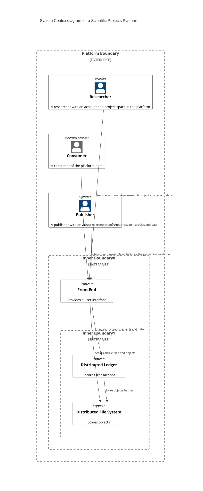
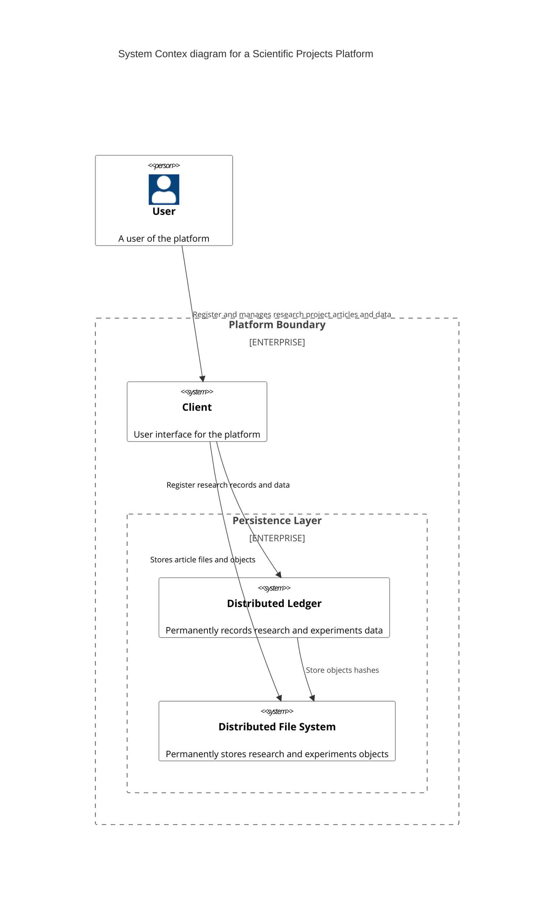
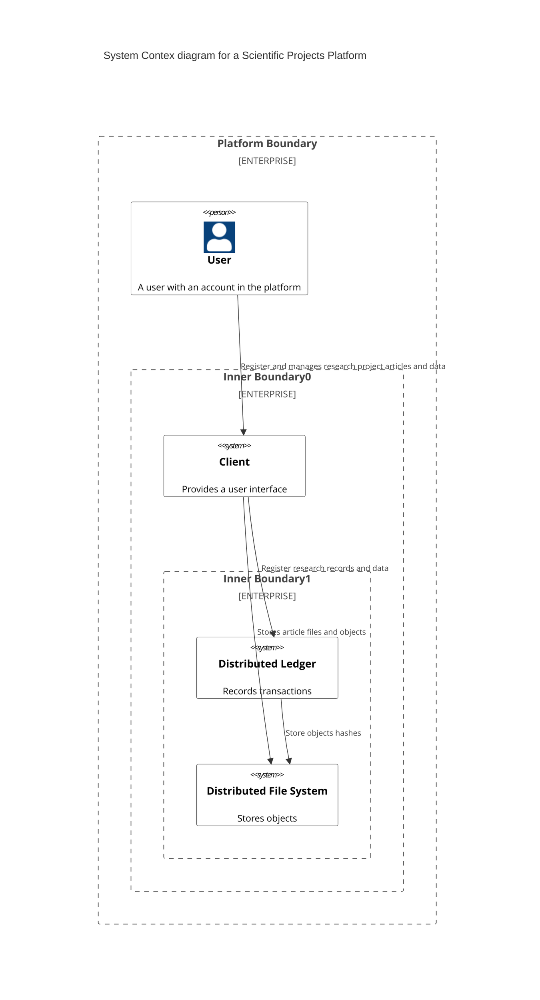
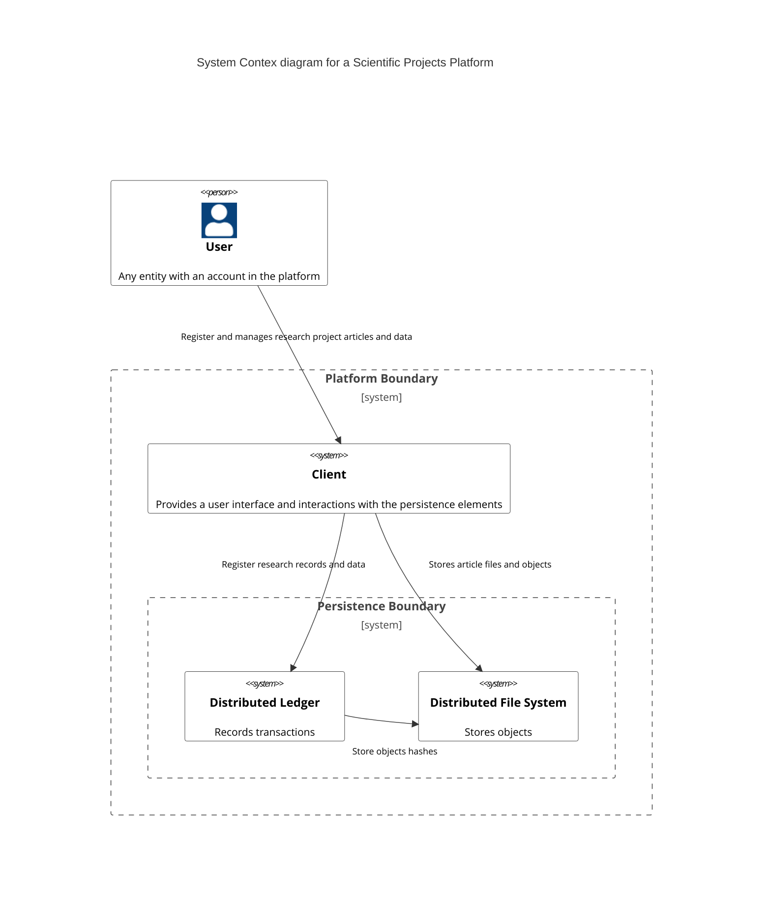
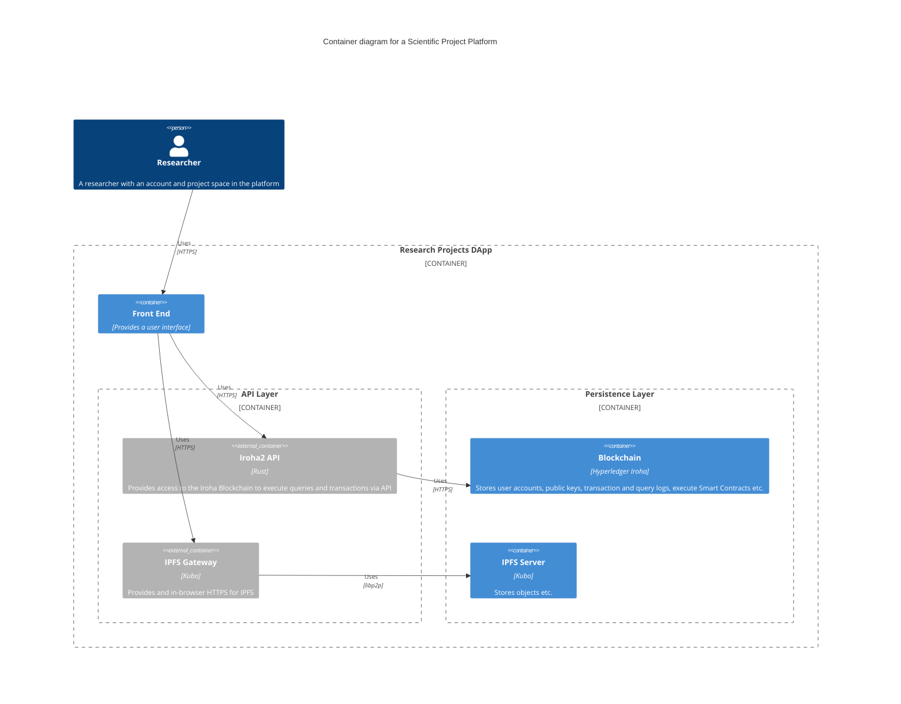
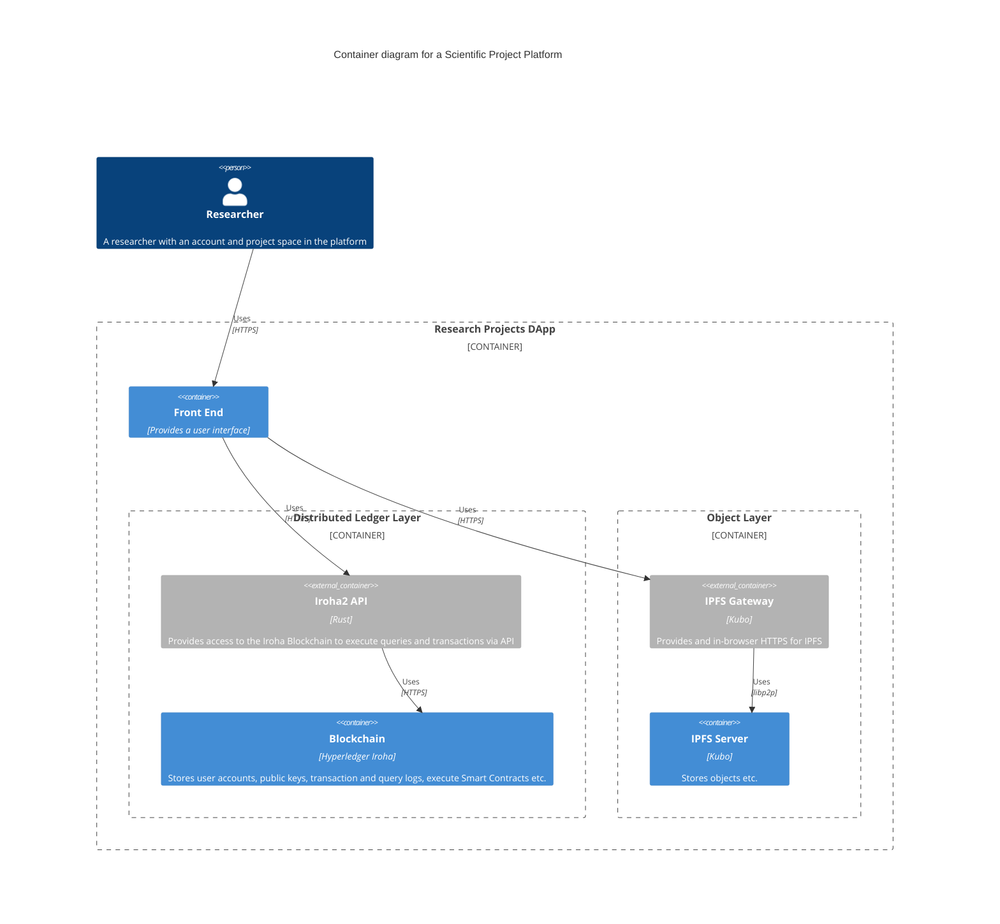
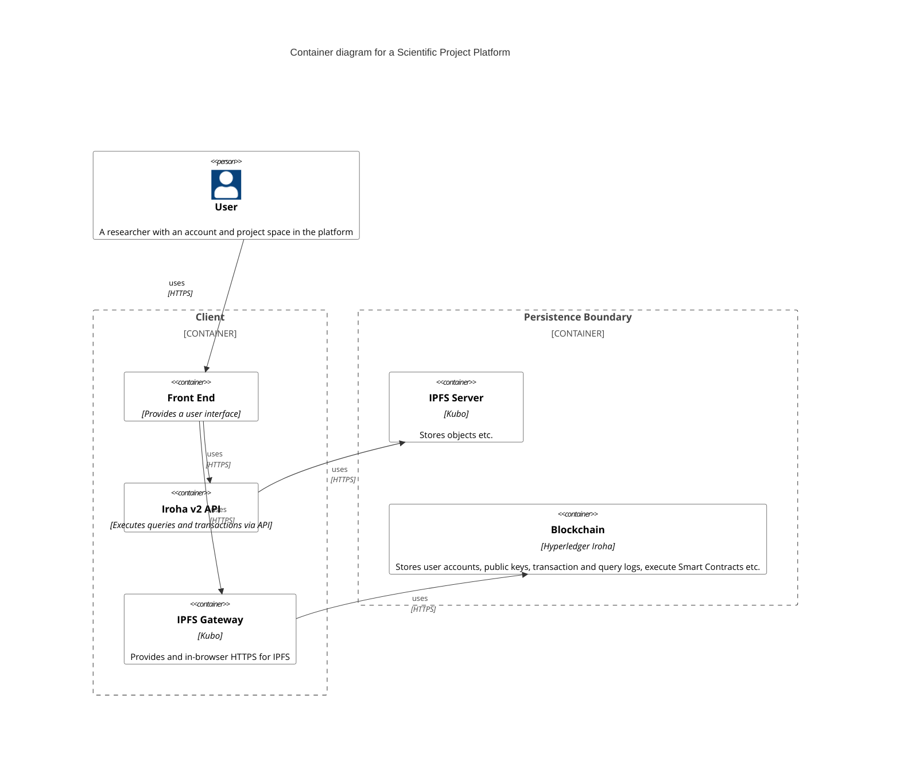
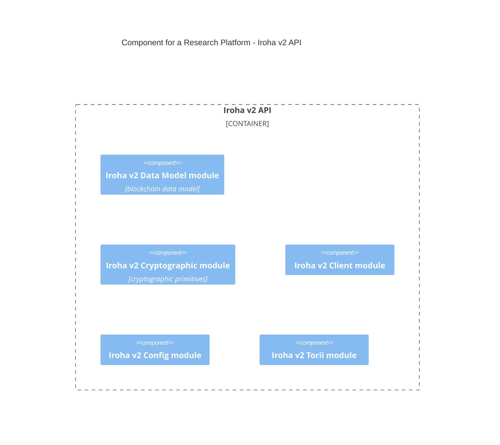
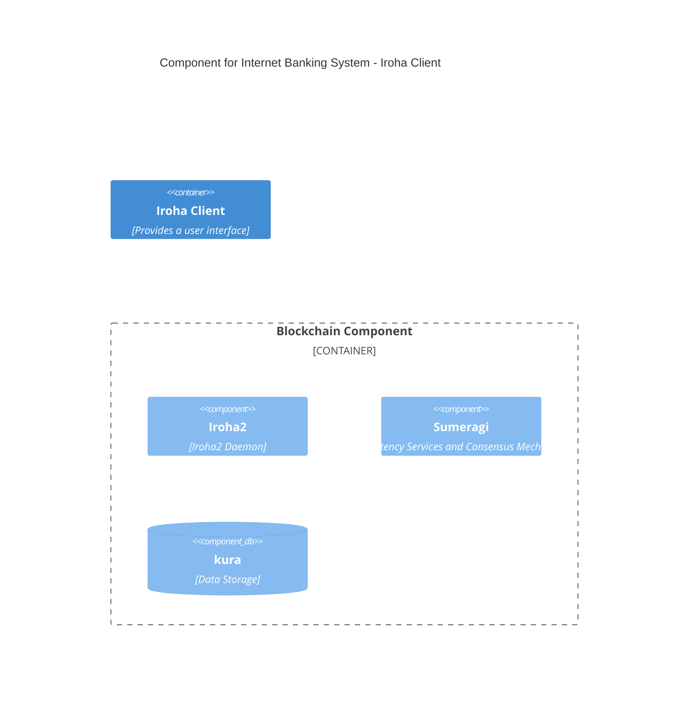
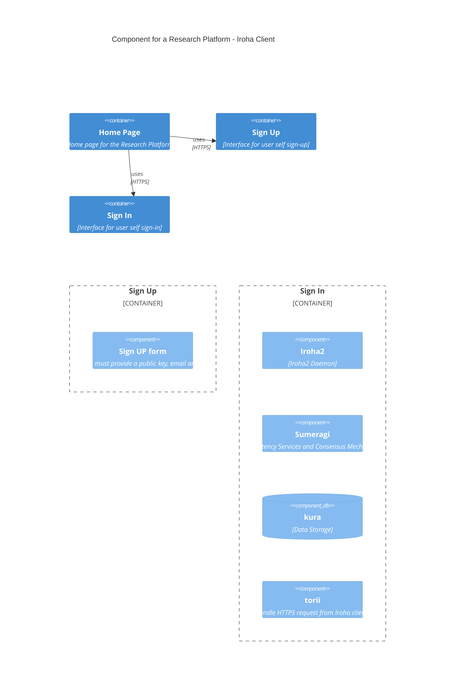

### Notes

- Avoid colors and use gray if necessary
- Develop a coherent connection between System, containers and components, observe names and notations
- Use the database symbol only when the element is clearly a discret representation of a database or repository.

- Confirm the protocols related to each inter process comumunication

- Add detailed information on each container box, e.g. What is the language for the front-end?

- go-ipfs/kubo https://hub.docker.com/r/ipfs/kubo/

- About C4 Diagrams https://medium.com/news-uk-technology/c4-model-a-better-way-to-visualise-software-architecture-df41e5ac57b8

## System Context Diagram

### System Context v1

#### Notes
- This version presents the  main user and respective roles, good approach for clarity and is self-explanatory, but the diagram upper part becomes clogged.

### System Context v2

#### Notes
- No outer boundary

### System Context v3

#### Notes
- Must specify that user is a generalization and that therer several user roles: researcher, reviewe, publisher, colaborator etc. 

---

### System Context v4 (The best design so far..)

## System Context Diagram for a Scientific Projects Platform (v4)

This system context diagram, depicts the actor and his/her interactions within the scientific projects platform, emphasizing the role-based access control system.

**Actor:**

* **User:** Represents any entity (individual or organization) possessing an account registered within the **Distributed Ledger (DLT) domain** (computer science). The user's account grants them access to the platform and defines their specific **roles** (e.g., researcher, reviewer, publisher, collaborator), which determine the scope of their permissible activities within the platform.

**System Components:**

* **Platform Boundary:** Encompasses the entirety of the system, demarcating its internal components from external entities.
* **Client:** This component serves as the **user interface (UI)** and central point for user interaction. It facilitates all user activities within the platform and manages interactions with the **persistence elements** (computer science), namely, the distributed ledger and the distributed file system.
* **Persistence Boundary:** Encapsulates the platform's data storage components responsible for persisting and retrieving information.
    * **Distributed Ledger:** This secure and tamper-proof system component acts as a **distributed ledger technology (DLT)**, permanently recording all transactions occurring within the platform.
    * **Distributed File System (IPFS):** This component functions as a **decentralized storage network**, facilitating the storage and retrieval of research articles, data files, and other associated objects.

**Interactions:**

* **Users:** Utilize the client to register with the platform, manage their research projects, and upload articles and data, acting as **primary data contributors** (computer science) based on their designated roles.
* **Client:** Interacts with the distributed ledger to register research records and data, ensuring **data immutability** (computer science) and **transactional integrity** (computer science).
* **Client:** Interacts with IPFS to store uploaded research articles and related objects, leveraging the **decentralized storage** (computer science) capabilities of the platform.
* **Distributed Ledger:** Interacts with IPFS to store **cryptographic hashes** (computer science) of stored objects, ensuring data integrity and facilitating **verifiable data provenance** (computer science).

**Additional Notes:**

* This revised diagram emphasizes the **role-based access control (RBAC)** (computer science) approach, where user accounts are associated with specific roles that define their permissions within the platform.
* The client acts as the central hub for user interactions, facilitating communication between users and the platform's persistence elements.
* The use of directional arrows in the relationships depicts the direction of information flow.

This description strives to maintain the clarity and conciseness of the previous descriptions while incorporating advanced academic language and computer science-specific terminology to elevate the quality of your dissertation's conceptual model section. Feel free to share further diagrams, and I will continue to provide comprehensive and informative descriptions tailored to your evolving needs.

## Container Diagram

##### Notes

#### Container Model v1

----

#### Container Model v2

#### Container Model v3

#### Notes

- Expand the client container to evidence the internal functionalities related to 1) Front-end, 2) Iroha2 API and 3) IPFS API

Container Diagram for a Scientific Projects Platform (v3)

This container diagram, rendered using Mermaid notation, delves into the internal components of the "Client" container from the previous system context diagram, revealing its functionalities and interactions with other containers.

Actor:

    User: Represents any entity (individual or organization) possessing an account registered within the platform.

Containers:

    Client: This container encapsulates the platform's user interface and core functionalities:
        Front-End: Provides a user-friendly graphical interface, allowing users to interact with the platform's features and manage their research projects.
        Iroha v2 API: Facilitates communication between the front-end and the blockchain by executing queries and transactions through the Iroha v2 API.
        IPFS Gateway (Kubo): Acts as an intermediary between the front-end and the IPFS network, enabling secure and browser-based access to IPFS resources using HTTPS (Hypertext Transfer Protocol Secure).

    Persistence Boundary: Encompasses the platform's data storage components.
        IPFS Server (Kubo): Stores research articles, data files, and other associated objects using the InterPlanetary File System (IPFS) protocol.
        Blockchain (Hyperledger Iroha): Functions as a distributed ledger technology (DLT) solution, securely storing user accounts, public keys, transaction and query logs, and potentially executing smart contracts to automate specific platform functionalities.

Interactions:

    Users: Interact with the platform through the front-end component, utilizing HTTPS for secure communication.
    Front-End: Communicates with the Iroha v2 API using HTTPS to execute queries and transactions on the blockchain.
    Front-End: Interacts with the IPFS Gateway (Kubo) using HTTPS to access and manage data stored within the IPFS network.
    Iroha v2 API: Potentially interacts with the IPFS container using HTTPS to retrieve or store data relevant to specific transactions.
    IPFS Gateway (Kubo): Might communicate with the Blockchain container using HTTPS depending on the platform's specific implementation and data access control mechanisms.

Additional Notes:

    This diagram emphasizes the modular design of the client container, separating its functionalities into distinct sub-components for better organization and maintainability.
    The use of HTTPS throughout the interactions ensures secure communication between different components within the platform.
    The potential interaction between the Iroha v2 API and the IPFS container highlights the flexibility of the platform's architecture to accommodate various data storage and access control strategies.

This description provides a detailed explanation of the client container's internal structure and its interactions with other containers, enhancing the comprehensiveness of your dissertation's documentation. Feel free to share additional diagrams, and I will continue to assist you in crafting clear and informative descriptions tailored to your specific needs.

## Component Diagram

### Iroha v2 API

----

---

