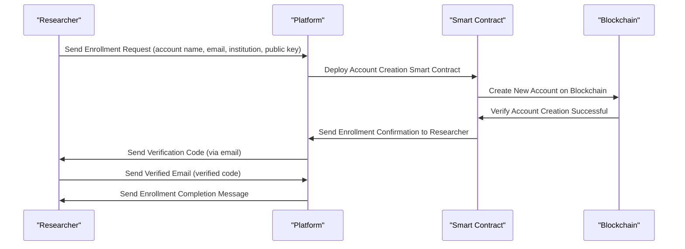
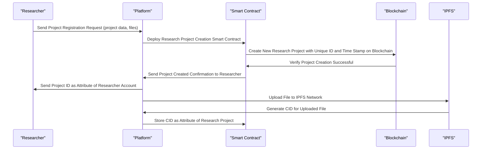
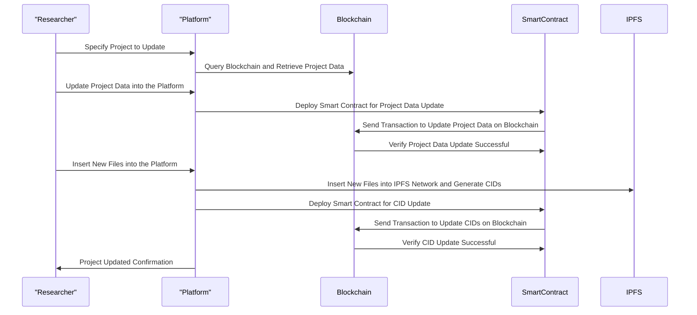
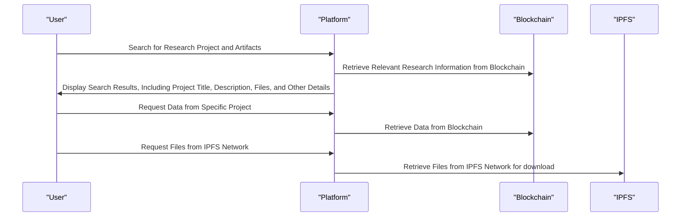
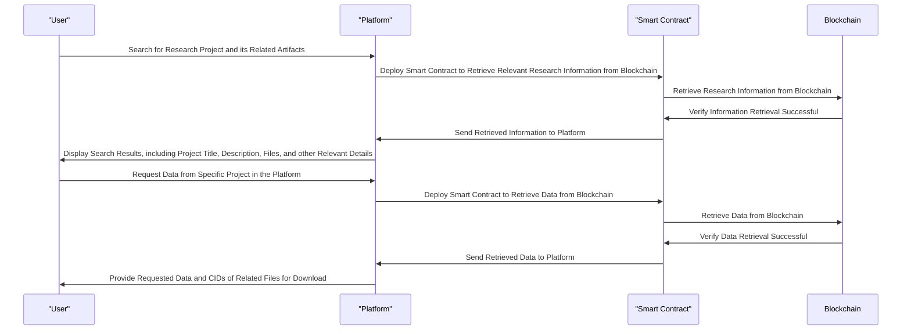

## Sequence Diagrams

This is a platform for storing research data on a blockchain and IPFS, from now on referred solely as Platform.
#### Actors

- Admin - Performs administrative tasks on the platform, such as domain creation, role and permission definitions, service contract deployments, monitoring and maintenance.

- Researcher - Self enrolls as a user of the platform and uses it for storing research data and artifacts.

- Public - Queries the platform to search and get information about research projects data and artifacts. 

#### Activities

- Enrollment
- Register a scientific project
- Updates
- Queries

##### Enrollment

Description

This is the first activity of a researcher in the platform, a self-service enrollment where the research signs up informing:

- account name
- email
- institution
- orcid
- public key

Actors

Researcher
Platform
Smart Contract
Blockchain
IPFS

Activities

User self enrolls in the platform providing account name, email, institution and public key
The platform deploys a smart contract for account creation into the blockchain
The platform deploys a smart contract for account detail settings into the blockchain

##### Register a project

Description

This is the complete description of the activity where the researcher register and store reseach project data and files into the platform.

Actors

Researcher
Platform
Smart Contract
Blockchain
IPFS

Activities:

1 - The researches register research data and files  in the platform 
2-  The platform deploys a smart contract for the creation of the research project with a unique id and time stamp into the blockchain
3 - The platform stores the unique id of the research project as attribute of the researcher account
4 - The platform upload a file to the IPFS network
5 - The IPFS network generate a CID for the uploaded file
6 - The platform retrieves the CID and stores as a attribute of the research project

##### Update a project

Description:

This description depicts an post enrollment activity where the researcher updates information and data into the platform.

Actors:

Researcher

Activities

This sequence diagram shows the flow of activities for updating a project:

1. The researcher specifies a project to update
2. The platform queries the blockchain and retrieves the project data
3. The researcher updates project's data into the platform
4. The platform deploys a Smart Contract and sends a transaction to update the project's data into the blockchain
5. The researcher inserts new files into the platform
6. The platform inserts the new files into the IPFS network, a CID is generated for every new file
7. The platform deploys a Smart Contract for the update of CIDs  into the blockchain
8. The project is updated

Note: How to deal with version control for data provenance? Some git like feature would be useful.

Here is the sequence diagram for Updating a Project:

##### Queries on the platform without a Smart Contract

Description:

A third party (another researcher, student or general public) that will access the platform to get information about the researches already stored.

Possible third parties are:

Researcher
Publishers
Reviewers
Student
General Public

Actors:

User

Activities:

This sequence diagram shows the flow of activities for querying the platform:

1. The user searches for a research project and its related artifacts on the platform.
2. The platform retrieves the relevant research information from the blockchain.
3. The platform displays the search results to the user, including project title, description, files, and other relevant details.
4. The user requests data from a specific project in the platform
5. The platform retrieves the data from the blockchain
6. The platform retrieves files from the IPFs network for download

Here is the revised sequence diagram for Queries on the platform:

##### Queries on the platform with a Smart Contract

Description:

A third party (another researcher, student or general public) that will access the platform to get information about the researches already stored.

Possible third parties are:

Researcher
Publishers
Reviewers
Student
General Public

Actors:

User

Activities:

This sequence diagram shows the flow of activities for querying the platform:

1. The user searches for a research project and its related artifacts on the platform.
2. The platform deploys a smart contract to retrieve the relevant research information from the blockchain.
3. The platform displays the search results to the user, including project title, description, files, and other relevant details.
4. The user requests data from a specific project in the platform
5. The platform a smart contract retrieves the data from the blockchain
6. The platform get CIDs of related files and retrieves them from the IPFs network for download

